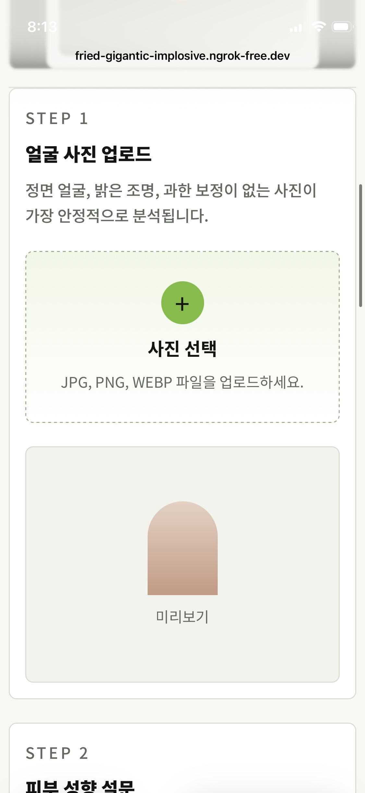
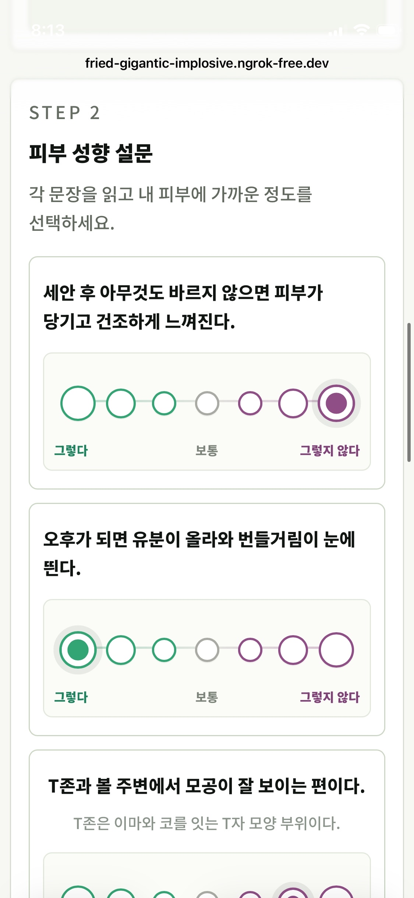
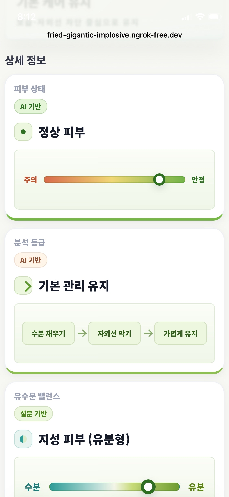
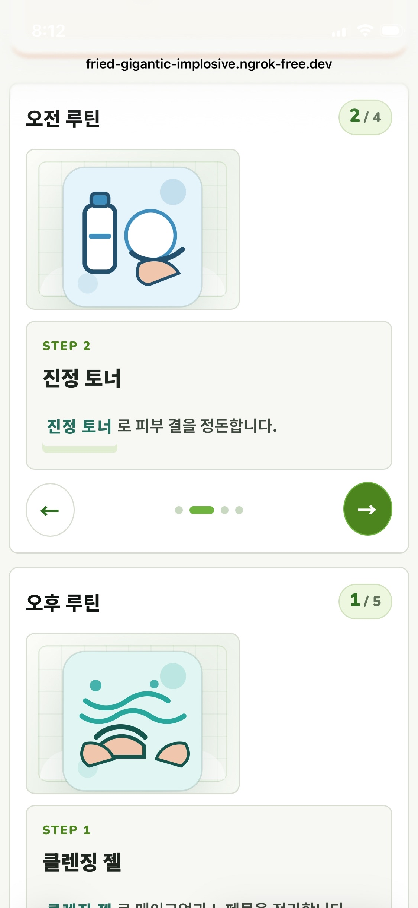
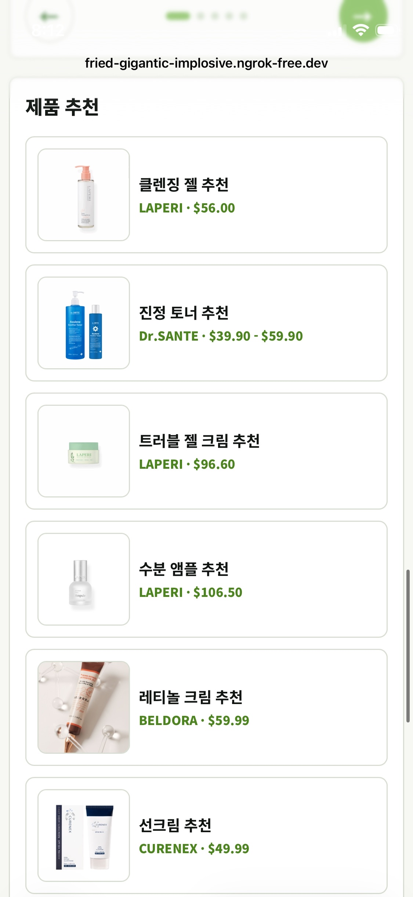

# Skin Care AI 프로젝트 발표자료

## 1. 프로젝트 개요

**Skin Care AI**는 사용자가 정면 얼굴 사진을 업로드하고 피부 성향 설문에 답하면, AI가 피부 상태를 분석하고 개인에게 맞는 관리 우선순위와 스킨케어 루틴, 제품 추천을 제공하는 웹 서비스입니다.

이 프로젝트는 단순히 사진을 분류하는 데서 끝나지 않고, 사진 기반 AI 분석 결과와 사용자의 주관적인 피부 성향 데이터를 함께 반영해 더 현실적인 피부 관리 리포트를 만드는 것을 목표로 합니다.

---

## 2. 서비스 목표

### 핵심 목표

1. 사용자가 자신의 피부 상태를 쉽고 빠르게 확인할 수 있게 한다.
2. AI 분석 결과를 어려운 수치가 아니라 이해하기 쉬운 리포트로 제공한다.
3. 사진 분석과 설문 결과를 결합해 개인화된 관리 방향을 제안한다.
4. 피부 타입별로 필요한 스킨케어 루틴과 제품을 추천한다.
5. 제품 추천을 통해 결과적으로 자사 제품을 홍보하게끔 한다.

### 해결하고자 한 문제

피부 관리는 사람마다 고민이 다르기 때문에 같은 제품이나 같은 루틴이 모두에게 맞지 않습니다. 하지만 사용자는 자신의 피부가 건성인지, 지성인지, 민감한지, 트러블 관리가 필요한지 정확히 판단하기 어렵습니다.

이 서비스는 사용자가 사진과 간단한 설문만 제공하면 현재 피부 상태와 관리 방향을 한 화면에서 확인할 수 있도록 도와줍니다.

---

## 3. 팀원별 역할

이번 프로젝트는 웹 화면 구성, 데이터 준비, 모델 학습, 백엔드 구축, 추천 알고리즘 구현을 역할별로 나누어 진행했습니다.

| 이름 | 담당 역할 |
|---|---|
| 김민기 | 웹사이트 디자인 |
| 이지원 | 데이터 분류, 모델 학습 및 테스트 |
| 김동현 | 웹 디자인, 설문 기반 제품 추천 알고리즘 |
| 장희우 | 학습 데이터 확보, 모델 학습 |
| 최진영 | 학습 데이터 확보, 웹 사이트 디자인 수정 |
| 이창희 | 백엔드 초기 구축 참여 |

---

## 4. 전체 서비스 흐름

```text
사용자
  ↓
정면 얼굴 사진 업로드
  ↓
피부 성향 설문 응답
  ↓
Flask 프론트엔드에서 입력값 수집
  ↓
FastAPI 백엔드로 사진과 설문 데이터 전송
  ↓
파일 검증 및 얼굴 감지
  ↓
PyTorch 모델로 피부 이미지 분류
  ↓
OpenCV 기반 보조 분석
  ↓
설문 기반 Skin MBTI 생성
  ↓
분석 결과 + 설문 결과 결합
  ↓
개인화 리포트, 루틴, 제품 추천 출력
```

---

## 5. 주요 기능

### 사진 기반 AI 피부 분석

사용자가 업로드한 얼굴 사진을 PyTorch 모델에 입력해 피부 상태를 분류합니다. 현재 프로젝트에서는 ResNet18 기반 분류 모델을 사용하며, 모델 파일은 `model/skin_model_best.pth`에 위치합니다.

분석 결과로는 예측 클래스, 신뢰도, 클래스별 점수, 피부 점수, 트러블 개수, 트러블 면적 비율 등이 생성됩니다.

### 설문 기반 피부 성향 분석

사용자는 건성/지성, 민감/저항성, 색소침착 경향, 주름/탄력 경향에 대한 문항에 답합니다.

서비스는 이 응답을 바탕으로 Skin MBTI 형태의 코드를 생성합니다.

```text
D / O : 건성 또는 지성
S / R : 민감성 또는 저항성
P / N : 색소침착 경향 또는 비색소성
W / T : 주름·탄력 관리 필요 또는 탄력 안정
```

예를 들어 `DSPW`는 건성, 민감성, 색소침착 경향, 주름 관리가 필요한 피부 성향을 의미합니다.

### 개인화 리포트 생성

AI 분석 결과와 설문 결과를 결합해 사용자가 이해하기 쉬운 리포트를 만듭니다.

리포트에는 다음 내용이 포함됩니다.

- 현재 피부 상태 요약
- 아침/저녁 스킨케어 루틴
- 추천 제품 목록
- 주의사항 및 참고 안내

---

## 5-1. 웹사이트 화면 구성

### PC 버전

PC 환경에서는 ngrok을 통해 로컬 Flask 웹사이트를 외부에서도 접속할 수 있게 연결했습니다.

서비스 접속 주소: [https://fried-gigantic-implosive.ngrok-free.dev](https://fried-gigantic-implosive.ngrok-free.dev)

### 앱 버전

앱 버전은 모바일 브라우저에서 ngrok 주소로 접속했을 때의 화면입니다. 실제 사용자가 휴대폰으로 사진을 올리고 설문을 진행하는 흐름을 기준으로 확인했습니다.












---

## 6. 알고리즘 구조

## 6-1. 이미지 입력 검증 알고리즘

먼저 업로드된 파일이 분석 가능한 이미지인지 확인합니다.

```text
1. 파일이 존재하는지 확인
2. 파일명이 비어 있지 않은지 확인
3. 확장자가 허용된 이미지 형식인지 확인
4. 파일 크기가 제한 용량 이내인지 확인
5. 안전한 파일명으로 변환
6. 임시 업로드 폴더에 저장
```

이 단계는 잘못된 파일 업로드, 너무 큰 파일, 경로 조작 위험을 막기 위한 보안 처리입니다.

---

## 6-2. 얼굴 감지 알고리즘

사진이 피부 분석에 적합한지 확인하기 위해 OpenCV의 Haar Cascade를 사용해 얼굴을 감지합니다.

```text
1. 업로드된 이미지를 OpenCV로 로드
2. 이미지가 너무 크면 분석하기 좋은 크기로 축소
3. 흑백 이미지로 변환
4. 히스토그램 평활화로 얼굴 특징을 더 잘 보이게 처리
5. 여러 Haar Cascade 분류기로 얼굴 탐색
6. 얼굴이 감지되면 분석 진행
7. 얼굴이 감지되지 않으면 재업로드 요청
```

이 과정을 통해 배경 이미지나 피부가 아닌 사진이 분석되는 문제를 줄입니다.

---

## 6-3. PyTorch 피부 분류 알고리즘

프로젝트의 핵심 AI 분석은 PyTorch 모델을 통해 수행됩니다.

### 모델 구조

```text
입력 이미지
  ↓
224 x 224 크기로 변환
  ↓
Tensor 변환
  ↓
ImageNet 기준 정규화
  ↓
ResNet18 모델 입력
  ↓
Softmax 확률 계산
  ↓
가장 높은 확률의 클래스 선택
```

모델은 ResNet18 구조를 사용하고, 마지막 fully connected layer를 프로젝트의 클래스 개수에 맞게 교체합니다.

### 예측 안정화

원본 이미지뿐 아니라 좌우 반전 이미지를 함께 예측합니다.

```text
원본 이미지 예측 확률
좌우 반전 이미지 예측 확률
두 확률의 평균 계산
최종 클래스 선택
```

이 방식은 얼굴 방향이나 좌우 편차에 따른 예측 흔들림을 줄이는 역할을 합니다.

---

## 6-4. 피부 영역 판별 알고리즘

이미지에 실제 피부 영역이 충분히 있는지 확인하기 위해 HSV 색공간을 활용합니다.

```text
1. 이미지를 HSV 색공간으로 변환
2. 피부색에 가까운 Hue, Saturation 범위 설정
3. 피부색으로 판단되는 픽셀 수 계산
4. 전체 이미지 대비 피부 픽셀 비율 계산
5. 비율이 너무 낮으면 not_skin으로 처리
```

이를 통해 얼굴이나 피부가 거의 없는 이미지가 모델 결과에 영향을 주는 상황을 줄입니다.

## 6-5. Skin MBTI 설문 알고리즘

설문은 4개의 피부 축으로 구성됩니다.

```text
건성 D  vs 지성 O
민감 S  vs 저항성 R
색소 P  vs 비색소 N
주름 W  vs 탄력 T
```

각 축마다 3개의 질문이 있고, 사용자의 답변을 A/B로 집계합니다.

```text
1. 각 축에 해당하는 3개 답변 수집
2. A 답변 개수와 B 답변 개수 계산
3. 더 많이 선택된 쪽을 해당 피부 성향으로 결정
4. 4개 축의 결과를 조합해 Skin MBTI 코드 생성
```

예시:

```text
건성(D) + 민감(S) + 색소(P) + 주름(W)
= DSPW 타입
```

---

## 6-6. 제품 추천 알고리즘

제품 추천은 AI 결과와 Skin MBTI 결과를 함께 사용합니다.

기본적으로 클렌저와 진정 토너는 공통 추천으로 시작합니다.

그 후 조건에 따라 제품을 추가합니다.

```text
건성 타입이면:
  수분 앰플, 보습 크림 추천

지성 또는 트러블 경향이면:
  블레미쉬 케어 제품 추천

AI가 트러블 경향을 감지하면:
  블레미쉬 크림 우선 추천

피부 점수가 낮으면:
  수분 앰플, 보습 크림 추가

주름 W 또는 색소 P 타입이면:
  레티놀 제품 추천

마지막에는 자외선 차단제 추천
```

중복 제품은 제거하고, 추천 순서를 유지합니다.

---

## 6-7. 루틴 생성 알고리즘

추천된 제품을 바탕으로 아침과 저녁 루틴을 생성합니다.

```text
아침 루틴:
  클렌징 → 토너 → 수분/진정/트러블 케어 → 보습 → 선크림

저녁 루틴:
  클렌징 → 토너 → 트러블 케어 또는 레티놀 → 수분/보습 마무리
```

AI 신뢰도가 낮은 경우에는 강한 기능성 제품보다 진정과 보습 중심의 루틴을 안내합니다.

---

## 7. 시스템 아키텍처

이 프로젝트는 프론트엔드와 백엔드를 분리한 구조입니다.

```text
Flask Frontend
  - 사용자 화면 렌더링
  - 사진 업로드 폼
  - 피부 설문 UI
  - 분석 결과 페이지 표시

FastAPI Backend
  - 파일 검증
  - 얼굴 감지
  - PyTorch 모델 추론
  - 설문 분석
  - 리포트 JSON 생성

PyTorch / OpenCV
  - 이미지 분류
  - 피부 영역 계산
  - 트러블 후보 영역 계산

Product Catalog
  - 추천 제품 정보 관리
  - 제품명, 브랜드, 가격, 이미지, URL 제공
```

---

## 8. 사용 기술

### Frontend

- HTML
- CSS
- JavaScript
- Flask
- Jinja2 Template

### Backend

- FastAPI
- Flask
- Python
- Uvicorn

### AI / Image Processing

- PyTorch
- Torchvision
- ResNet18
- OpenCV
- Pillow
- NumPy

### 품질 및 운영 요소

- 파일 업로드 검증
- 예외 처리
- 로깅
- CORS 설정
- Health Check API
- 환경 변수 기반 설정

---

## 9. 주요 코드 역할

```text
app.py
  Flask 프론트엔드 서버.
  사용자의 업로드와 설문 데이터를 받아 FastAPI 백엔드로 전달한다.

main.py
  FastAPI 백엔드 서버.
  실제 분석 요청을 처리하고 JSON 결과를 반환한다.

torch_skin_model.py
  PyTorch 모델 로딩, 이미지 전처리, 예측, 피부 점수 계산을 담당한다.

skin_analyzer.py
  얼굴 감지, 설문 분석, 제품 추천, 루틴 생성 등 보조 분석 로직을 담당한다.

pytorch_report.py
  AI 분석 결과를 사용자에게 보여줄 리포트 형태로 변환한다.

hyafilia_products.py
  추천에 사용할 제품 카탈로그 데이터를 관리한다.

config.py
  모델 경로, 업로드 제한, 서버 주소, 분석 기준값 등을 중앙에서 관리한다.
```

---

## 10. 결과 화면 구성

분석 결과 페이지는 사용자가 바로 이해할 수 있도록 다음 정보를 중심으로 구성됩니다.

1. AI가 판단한 피부 상태
2. 현재 관리 우선순위
3. 피부 성향 설문 결과
4. AI 판단 신뢰도
5. 아침 루틴
6. 저녁 루틴
7. 추천 제품
8. 참고 및 주의사항

이 구조는 사용자가 “내 피부가 어떤 상태인지”뿐만 아니라 “그래서 무엇을 해야 하는지”까지 확인할 수 있게 합니다.

---
## 11. 한계점

1. 사진의 조명, 각도, 화질에 따라 분석 결과가 달라질 수 있습니다.
2. 현재 결과는 의료 진단이 아니라 참고용 피부 관리 안내입니다.
3. 모델 성능은 학습 데이터의 품질과 다양성에 영향을 받습니다.
4. 피부색, 촬영 환경, 보정 여부에 따라 HSV 기반 보조 분석이 흔들릴 수 있습니다.

---

## 12. 개선 방향

- 더 다양한 피부 이미지 데이터셋 확보
- 여드름, 홍조, 색소침착, 주름 등 다중 라벨 모델로 확장
- 얼굴 부위별 분석 모델 적용
